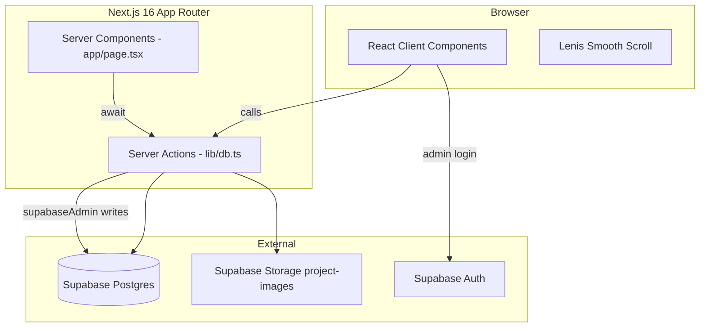
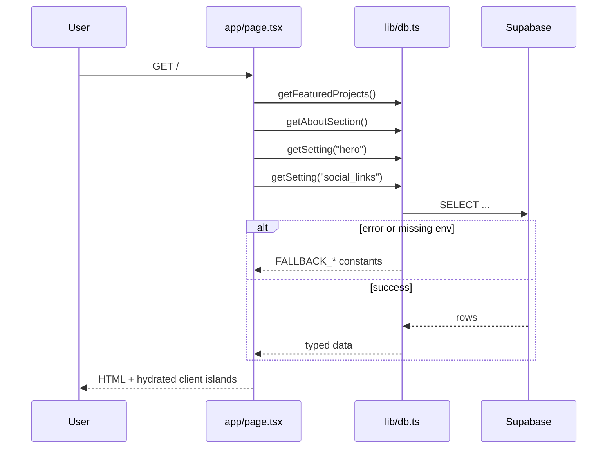
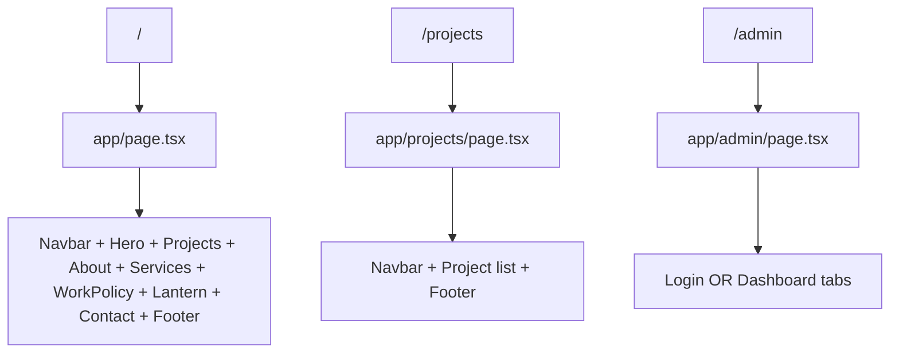
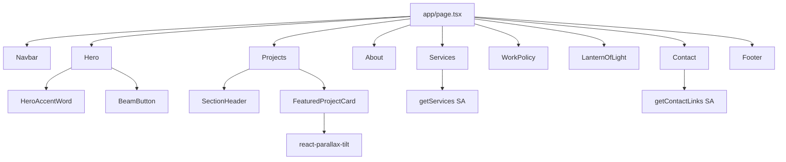
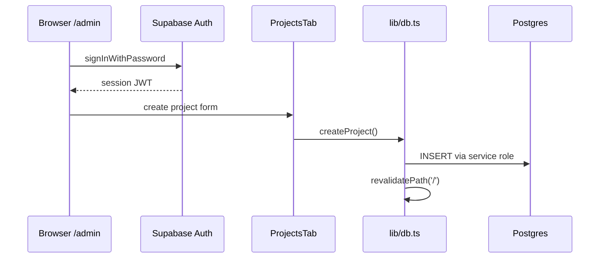
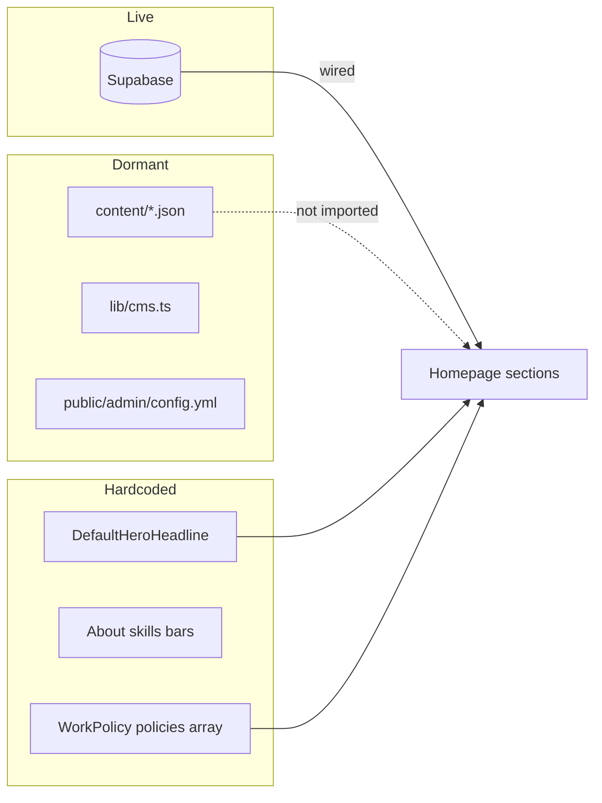

# SyedCodes.UI Portfolio — Project Master Handbook

> **Purpose:** This document is an Obsidian-optimized engineering handbook for the repository at `c:\Buisiness\web\laiban_portfolio\syedcodes`. It explains the project from first principles for complete beginners through advanced developers. Every section reflects the **current codebase** as audited on 2026-05-29.

---

## Table of Contents

1. [[#1-project-overview|Project Overview]]
2. [[#2-architecture|Architecture]]
3. [[#3-nextjs-guide|Next.js Guide (App Router)]]
4. [[#4-react-fundamentals-in-this-repo|React Fundamentals in This Repo]]
5. [[#5-tailwind-css-and-design-tokens|Tailwind CSS and Design Tokens]]
6. [[#6-framer-motion-and-animation-system|Framer Motion and Animation System]]
7. [[#7-threejs-gsap-swiper-and-unused-dependencies|Three.js, GSAP, Swiper, and Unused Dependencies]]
8. [[#8-supabase-backend|Supabase Backend]]
9. [[#9-admin-panel|Admin Panel]]
10. [[#10-public-folder-and-static-assets|Public Folder and Static Assets]]
11. [[#11-content-json-and-libcms|Content JSON and lib/cms.ts]]
12. [[#12-github-workflow|GitHub Workflow]]
13. [[#13-terminal-and-npm-scripts|Terminal and npm Scripts]]
14. [[#14-deployment-netlify|Deployment (Netlify)]]
15. [[#15-environment-variables|Environment Variables]]
16. [[#16-component-breakdown|Component Breakdown]]
17. [[#17-page-breakdown|Page Breakdown]]
18. [[#18-design-system|Design System]]
19. [[#19-troubleshooting|Troubleshooting]]
20. [[#20-safe-editing-guidelines|Safe Editing Guidelines]]
21. [[#21-scaling-the-project|Scaling the Project]]
22. [[#22-performance|Performance]]
23. [[#23-seo|SEO]]
24. [[#24-security|Security]]
25. [[#25-learning-roadmap|Learning Roadmap]]
26. [[#26-architecture-diagrams|Architecture Diagrams]]
27. [[#27-rebuild-from-scratch|Rebuild from Scratch]]

---

## 1. Project Overview

### 1.1 What this project is

**SyedCodes.UI** is a personal portfolio and digital-studio marketing site for **Laiban Shah (SyedCodes.UI)**. It presents:

- A **Wibify-inspired** cinematic hero (lime accent, grid grain, studio typography)
- **Featured projects** from Supabase (or fallback data)
- **About**, **Services**, **Work & Privacy Policy**, **Lantern of Light**, and **Contact** sections
- A separate **`/projects`** page listing all projects
- An **`/admin`** dashboard protected by **Supabase Auth** (email/password)

The site is built with **Next.js 16.2.6**, **React 19.2.4**, **TypeScript**, **Tailwind CSS v4**, **Framer Motion**, and deployed to **Netlify**.

### 1.2 What this project is not

| Expectation | Reality in current code |
|-------------|-------------------------|
| Testimonials carousel | **No Testimonials section** exists |
| Three.js 3D hero | **Three.js not installed or used** |
| GSAP timeline animations | **`gsap` in package.json but zero imports** |
| Swiper sliders | **`swiper` in package.json but zero imports** |
| JSON-driven hero headline from Supabase | Hero uses **hardcoded `DefaultHeroHeadline`**; Supabase `hero` setting only affects subtitle fallback |
| `policy.json` driving Work Policy | **`WorkPolicy` is not wired** — see [[#11-content-json-and-libcms]] |
| Netlify CMS as live CMS | **`lib/cms.ts` and `content/` exist but are not imported by pages** |
| `ProjectCard` on homepage | Homepage uses **`FeaturedProjectCard`** only |

### 1.3 Package identity

From `package.json`:

```json
{
  "name": "laiban_portfolio",
  "version": "0.1.0",
  "scripts": {
    "dev": "next dev",
    "build": "next build",
    "start": "next start",
    "lint": "eslint"
  }
}
```

### 1.4 Homepage section order

`app/page.tsx` renders sections in this order:

1. `Navbar` (fixed)
2. `Hero` (`#home`)
3. `Projects` (`#projects`) — featured only
4. `About` (`#about`)
5. `Services` (`#services`)
6. `WorkPolicy` (`#process`)
7. `LanternOfLight`
8. `Contact` (`#contact`)
9. `Footer`

There is **no** `#testimonials` anchor and no testimonial component file.

### 1.5 Full folder tree (source and config)

Excludes `node_modules/`, `.next/`, and `.git/`:

```
syedcodes/
├── AGENTS.md
├── CLAUDE.md
├── PROJECT-MASTER-HANDBOOK.md          ← this file
├── OBSIDIAN_DOCUMENTATION.md           ← older doc (may drift)
├── README.md                           ← default create-next-app readme
├── SUPABASE_SETUP.md                   ← SQL + admin instructions
├── components.json                     ← shadcn/ui config
├── eslint.config.mjs
├── netlify.toml
├── next.config.ts
├── package.json
├── package-lock.json
├── postcss.config.mjs
├── tsconfig.json
├── app/
│   ├── admin/
│   │   └── page.tsx                    ← Admin UI (client component)
│   ├── projects/
│   │   └── page.tsx                    ← All projects (server)
│   ├── globals.css                     ← Tailwind v4 + design tokens
│   ├── layout.tsx                      ← Root layout, fonts, providers
│   └── page.tsx                        ← Homepage (server)
├── components/
│   ├── admin/
│   │   ├── AboutTab.tsx
│   │   ├── ContactTab.tsx
│   │   ├── ProjectsTab.tsx
│   │   ├── ServicesTab.tsx
│   │   └── SettingsTab.tsx
│   ├── ui/                             ← shadcn primitives
│   │   ├── avatar.tsx
│   │   ├── badge.tsx
│   │   ├── button.tsx
│   │   ├── card.tsx
│   │   ├── dialog.tsx
│   │   ├── dropdown-menu.tsx
│   │   ├── input.tsx
│   │   ├── separator.tsx
│   │   ├── sheet.tsx
│   │   ├── tabs.tsx
│   │   └── textarea.tsx
│   ├── About.tsx
│   ├── BeamButton.tsx                  ← Wibify-style CTA
│   ├── Contact.tsx
│   ├── FeaturedProjectCard.tsx         ← parallax tilt cards
│   ├── Footer.tsx
│   ├── Hero.tsx
│   ├── HeroAccentWord.tsx              ← SVG underline accents
│   ├── LanternOfLight.tsx
│   ├── Navbar.tsx
│   ├── ProjectCard.tsx                 ← unused on homepage
│   ├── Projects.tsx
│   ├── SectionHeader.tsx
│   ├── Services.tsx
│   ├── SmoothScroll.tsx                ← Lenis wrapper
│   └── WorkPolicy.tsx
├── content/                            ← JSON files (mostly unwired)
│   ├── pages/
│   │   ├── lantern.json
│   │   └── policy.json                 ← NOT loaded by WorkPolicy
│   ├── projects/
│   │   ├── raw-society.json
│   │   └── soul-metapoetry.json
│   └── settings/
│       └── general.json
├── lib/
│   ├── cms.ts                          ← filesystem JSON helpers (unused by app)
│   ├── db.ts                           ← "use server" Supabase actions
│   ├── motion.ts                       ← Framer Motion variants
│   ├── supabase.ts                     ← Supabase clients
│   ├── types.ts                        ← DB TypeScript interfaces
│   └── utils.ts                        ← cn() helper
└── public/
    ├── admin/
    │   └── config.yml                  ← Netlify CMS config (legacy)
    ├── file.svg
    ├── vercel.svg
    └── window.svg
```

**Note:** Components reference `/assets/myimage.jpg`, `/assets/lol.png`, etc. Those paths are **not present** in the tracked `public/` folder in git; you must add `public/assets/` locally for images to render.

---

## 2. Architecture

### 2.1 High-level layers



### 2.2 Server vs client split

| Layer | Files | Runs where |
|-------|-------|------------|
| **Server Components** | `app/page.tsx`, `app/projects/page.tsx` | Node during SSR/SSG |
| **Server Actions** | `lib/db.ts` (`"use server"`) | Server only; callable from client |
| **Client Components** | Most of `components/*` with `"use client"` | Browser |
| **Shared lib** | `lib/supabase.ts`, `lib/types.ts`, `lib/motion.ts` | Imported both sides |

### 2.3 Data flow: homepage



### 2.4 Data flow: client-fetched sections

`Services` and `Contact` are **client components** that call server actions in `useEffect`:

```typescript
// components/Services.tsx (pattern)
useEffect(() => {
  loadServices();
}, []);

const loadServices = async () => {
  const data = await getServices(); // server action from lib/db.ts
  setServices(data);
};
```

This means Services/Contact content appears **after hydration**, with a brief moment where the section returns `null` while `loading` is true.

### 2.5 Fallback strategy

`lib/db.ts` embeds large `FALLBACK_*` arrays/objects. If Supabase env vars are missing or queries fail, the site **still builds and renders** demo content. This is intentional for Netlify CI builds without secrets.

---

## 3. Next.js Guide (App Router)

### 3.1 What is Next.js (first principles)

**Next.js** is a React framework that adds:

- **File-based routing** — folders under `app/` become URLs
- **Server rendering** — HTML generated on the server for speed and SEO
- **Bundling and optimization** — code splitting, image optimization, fonts

This project uses the **App Router** (`app/` directory), not the legacy Pages Router (`pages/`).

### 3.2 Routes in this project

| URL | File | Type |
|-----|------|------|
| `/` | `app/page.tsx` | Server Component |
| `/projects` | `app/projects/page.tsx` | Server Component |
| `/admin` | `app/admin/page.tsx` | Client Component (entire page) |

There are **no** `app/api/` route handlers. All backend I/O goes through **Server Actions** in `lib/db.ts`.

### 3.3 Root layout

`app/layout.tsx` wraps every page:

- Loads **Inter** and **Instrument Serif** via `next/font/google`
- Imports **Clash Display** from Fontshare CDN in `<head>`
- Sets `metadata` (title, description)
- Forces `className="... dark"` on `<html>` (dark theme default)
- Wraps children in `ThemeProvider` (next-themes, system theme disabled)
- Wraps in `SmoothScroll` (Lenis)
- Loads **Netlify Identity** scripts (legacy; admin uses Supabase instead)
- Renders `Toaster` from Sonner

```typescript
export const metadata: Metadata = {
  title: "SyedCodes.UI | Premium Web Development Portfolio",
  description:
    "Personal portfolio for SyedCodes.UI showcasing luxury web development, React, Next.js, and client-focused solutions.",
};
```

### 3.4 Server Actions and `revalidatePath`

`lib/db.ts` begins with `"use server"`. Every exported function is a **Server Action**. Mutations call:

```typescript
revalidatePath('/');
revalidatePath('/projects');
```

So after admin edits, Next.js invalidates cached pages on the next request.

### 3.5 Images and `next.config.ts`

Remote images from Supabase Storage are allowed:

```typescript
images: {
  remotePatterns: [
    {
      protocol: "https",
      hostname: "enmlevvmvygmmhkppmrg.supabase.co",
      pathname: "/storage/v1/object/public/**",
    },
  ],
},
```

If you change Supabase projects, **update this hostname**.

### 3.6 Next.js 16 note (AGENTS.md)

This repo pins **Next.js 16.2.6**, which may differ from older tutorials. Check `node_modules/next/dist/docs/` for version-specific APIs before copying Stack Overflow answers.

---

## 4. React Fundamentals in This Repo

### 4.1 React in one paragraph

**React** builds UIs from **components** (functions that return JSX). When **state** changes, React re-renders the affected components. **Props** pass data parent → child.

### 4.2 `"use client"` vs Server Components

- **Server Component** (default in `app/`): Can `async`/`await` data fetching directly; no `useState`, no browser APIs.
- **Client Component** (`"use client"` at top): Can use hooks, event listeners, Framer Motion, Lenis.

Example server page:

```typescript
// app/page.tsx
export default async function Home() {
  const projects = await getFeaturedProjects();
  return (
    <main>
      <Hero title={heroSettings?.value?.title} subtitle={heroSettings?.value?.subtitle} />
      <Projects projects={projects} />
    </main>
  );
}
```

### 4.3 Hooks used in this codebase

| Hook | Where | Purpose |
|------|-------|---------|
| `useState` | Navbar, admin, Services, Contact | UI state |
| `useEffect` | Services, Contact, admin auth | Fetch on mount, auth subscription |
| Framer Motion | Hero, sections | Scroll/viewport animations |

### 4.4 Composition pattern

Sections are **dumb presentational components** fed by:

- Server-fetched props (`Projects`, `About`, `Hero` partial props)
- Client-fetched state (`Services`, `Contact`)
- Hardcoded defaults (`WorkPolicy`, `LanternOfLight`, hero headline)

---

## 5. Tailwind CSS and Design Tokens

### 5.1 Tailwind v4 in this project

`app/globals.css` uses Tailwind v4 syntax:

```css
@import "tailwindcss";
@import "tw-animate-css";
@import "shadcn/tailwind.css";
```

Theme tokens are defined in `@theme inline { ... }` mapping CSS variables to Tailwind color utilities.

### 5.2 Brand colors

```css
:root {
  --background: #080808;
  --foreground: #f5f5f5;
  --brand: #d4ff4a;
  --brand-glow: rgba(212, 255, 74, 0.35);
  --primary: #d4ff4a;
  --primary-foreground: #0a0a0a;
}
```

Use utilities: `bg-brand`, `text-brand`, `border-brand/25`, `glow-brand`.

### 5.3 Custom utility classes

| Class | Purpose |
|-------|---------|
| `.container-premium` | Max-width 1320px centered padding |
| `.section-padding` | Vertical section rhythm `py-24` → `py-40` |
| `.premium-card` | Card surface + hover border |
| `.btn-primary` / `.btn-outline` | CTA styles |
| `.label-studio` | Section label with lime dot |
| `.beam-button` | Animated border beam CTA |
| `.grain-overlay` | SVG noise texture |
| `.font-accent` | Instrument Serif italic |

### 5.4 Typography stack

- **Body:** Inter (`--font-inter`)
- **Headings:** Clash Display (CDN) via `font-heading`
- **Accent words:** Instrument Serif italic via `font-accent` on `HeroAccentWord`

---

## 6. Framer Motion and Animation System

### 6.1 Central variants — `lib/motion.ts`

```typescript
const easeOut = [0.22, 1, 0.36, 1] as const;

export const fadeUp = {
  hidden: { opacity: 0, y: 32 },
  visible: (delay = 0) => ({
    opacity: 1,
    y: 0,
    transition: { duration: 0.7, delay, ease: easeOut },
  }),
};

export const staggerContainer = {
  hidden: { opacity: 0 },
  visible: {
    opacity: 1,
    transition: { staggerChildren: 0.12, delayChildren: 0.1 },
  },
};

export const staggerItem = {
  hidden: { opacity: 0, y: 24 },
  visible: {
    opacity: 1,
    y: 0,
    transition: { duration: 0.6, ease: easeOut },
  },
};
```

### 6.2 Usage patterns

- **Hero:** `animate` on mount (`initial` → `animate`)
- **Sections:** `whileInView` with `viewport={{ once: true }}` for scroll reveals
- **Navbar:** entrance animation + `AnimatePresence` mobile menu

### 6.3 Lenis (smooth scroll)

`components/SmoothScroll.tsx`:

```typescript
<ReactLenis root options={{ lerp: 0.05, duration: 1.5, smoothWheel: true }}>
  {children}
</ReactLenis>
```

`BeamButton` and `Navbar` also implement **manual** `window.scrollTo` for hash links with offset `88px` (navbar height).

### 6.4 react-parallax-tilt (not Framer)

`FeaturedProjectCard` and `ProjectCard` use **`react-parallax-tilt`** for 3D hover tilt and lime glare — separate from Framer Motion.

---

## 7. Three.js, GSAP, Swiper, and Unused Dependencies

### 7.1 Three.js

**Not present.** No `three`, `@react-three/fiber`, or `@react-three/drei` in `package.json`. No WebGL canvas in components.

**If you want a 3D hero later:** install Three.js ecosystem packages, create a client-only dynamic import (`next/dynamic` with `ssr: false`), and isolate in `components/HeroCanvas.tsx`.

### 7.2 GSAP

Listed in `package.json` (`"gsap": "^3.15.0"`) but **no source file imports `gsap`**. Safe to remove if bundle size matters, or wire up for complex timelines.

### 7.3 Swiper

Listed (`"swiper": "^12.1.4"`) but **unused**. No carousel component exists.

### 7.4 Other dormant dependencies

| Package | Status |
|---------|--------|
| `react-type-animation` | Not imported in `.tsx` files |
| `react-intersection-observer` | Not imported (Framer `whileInView` used instead) |
| `netlify-identity-widget` | Script in layout; **admin auth is Supabase** |
| `@supabase/auth-helpers-nextjs` | In package.json; **direct `supabase-js` used** |

### 7.5 What is actually used for motion

1. **Framer Motion** — section reveals, hero, admin transitions  
2. **CSS keyframes** — `beam-rotate`, `beam-pulse` on `.beam-button`  
3. **react-parallax-tilt** — project cards  
4. **Lenis** — smooth scrolling  

---

## 8. Supabase Backend

### 8.1 What Supabase provides here

**Supabase** is a hosted Postgres database with:

- **REST/JS client** for queries
- **Row Level Security (RLS)** for read policies
- **Storage** for project screenshots
- **Auth** for admin login

### 8.2 Client setup — `lib/supabase.ts`

```typescript
const supabaseUrl = process.env.NEXT_PUBLIC_SUPABASE_URL || '';
const supabaseAnonKey = process.env.NEXT_PUBLIC_SUPABASE_ANON_KEY || '';

export const supabase = createClient(urlToUse, anonKeyToUse);

export const supabaseAdmin = supabaseServiceKey
  ? createClient(urlToUse, supabaseServiceKey)
  : supabase;
```

- **`supabase`**: public anon key — used for reads and client-side auth
- **`supabaseAdmin`**: service role — used in server actions for **writes** (bypasses RLS)

If env vars are missing, placeholder URL/key prevent `createClient` from throwing at build time.

### 8.3 Database schema (from SUPABASE_SETUP.md)

| Table | Purpose |
|-------|---------|
| `projects` | Portfolio items (`featured` boolean, `tech_stack` text array) |
| `services` | Service cards with `icon_name`, `order_index` |
| `about_section` | Single-row about copy |
| `contact_links` | Social/contact URLs with icons |
| `settings` | Key/value JSONB (`hero`, `social_links`) |

Storage bucket: **`project-images`** (public read, service role upload/delete).

### 8.4 Server actions — `lib/db.ts`

All CRUD lives in one file with `"use server"`. Examples:

**Read (public client):**

```typescript
export async function getFeaturedProjects(): Promise<Project[]> {
  const { data, error } = await supabase
    .from('projects')
    .select('*')
    .eq('featured', true)
    .order('created_at', { ascending: false });
  if (error) return FALLBACK_PROJECTS.filter(p => p.featured);
  return data || FALLBACK_PROJECTS.filter(p => p.featured);
}
```

**Write (admin client):**

```typescript
export async function createProject(project: Omit<Project, 'id' | 'created_at' | 'updated_at'>) {
  const { data, error } = await supabaseAdmin.from('projects').insert(project).select().single();
  if (error) throw error;
  revalidatePath('/');
  revalidatePath('/projects');
  return data;
}
```

**Image upload:**

```typescript
export async function uploadProjectImage(formData: FormData): Promise<string> {
  const buffer = Buffer.from(await file.arrayBuffer());
  await supabaseAdmin.storage.from('project-images').upload(filePath, buffer, { contentType: file.type });
  return supabaseAdmin.storage.from('project-images').getPublicUrl(filePath).data.publicUrl;
}
```

### 8.5 Types — `lib/types.ts`

```typescript
export interface Project {
  id: string;
  title: string;
  description: string;
  link: string;
  image_url: string | null;
  tech_stack: string[];
  featured: boolean;
  created_at: string;
  updated_at: string;
}
```

Keep types aligned with SQL columns when migrating.

### 8.6 RLS model

- **Public SELECT** on all content tables (policies in SUPABASE_SETUP.md)
- **Writes** via service role in server actions (no anon write policies required)

For production hardening, restrict admin writes to authenticated users at the **application layer** (currently: anyone with Supabase user credentials can call actions if they craft requests — service role is server-only, but server actions are invokable from authenticated admin UI).

---

## 9. Admin Panel

### 9.1 URL and entry

- **Route:** `/admin` → `app/admin/page.tsx`
- **Auth:** Supabase `signInWithPassword` / `signOut`
- **Not protected at middleware level** — protection is UI-gated (session check). Consider adding Next.js middleware for production.

### 9.2 Login flow

```typescript
const { data, error } = await supabase.auth.signInWithPassword({ email, password });
```

On success, `session` state renders the dashboard. On failure, Sonner toast shows error.

### 9.3 Tabs

| Tab | Component | Server actions used |
|-----|-----------|---------------------|
| Projects | `ProjectsTab.tsx` | `getProjects`, `createProject`, `updateProject`, `deleteProject`, `uploadProjectImage` |
| Services | `ServicesTab.tsx` | `getServices`, CRUD |
| About | `AboutTab.tsx` | `getAboutSection`, `updateAboutSection` |
| Contact | `ContactTab.tsx` | `getContactLinks`, CRUD |
| Settings | `SettingsTab.tsx` | `getAllSettings`, `updateSetting` |

### 9.4 Projects tab behavior

- Form fields: title, description, link, tech stack (comma-separated), featured checkbox
- Image upload via `FormData` → `uploadProjectImage`
- Replaces old storage object on edit when new file uploaded

### 9.5 Legacy Netlify Identity

`app/layout.tsx` still loads:

```html
<script src="https://identity.netlify.com/v1/netlify-identity-widget.js"></script>
```

Redirect script sends login to `/admin/`. This is **redundant** with Supabase Auth but harmless if unused.

### 9.6 Creating an admin user

In Supabase Dashboard → **Authentication** → **Users** → Add user with email/password. Use those credentials at `/admin`.

---

## 10. Public Folder and Static Assets

### 10.1 What `public/` does

Files in `public/` are served at the site root. `public/file.svg` → `https://yoursite.com/file.svg`.

### 10.2 Current tracked files

```
public/
├── admin/config.yml    ← Netlify CMS schema (not wired to live data path)
├── file.svg
├── vercel.svg
└── window.svg
```

### 10.3 Expected assets (referenced in code but may be local-only)

| Path | Used by |
|------|---------|
| `/assets/myimage.jpg` | `Hero.tsx` portrait |
| `/assets/lol.png` | `LanternOfLight.tsx` |
| `/assets/hero-bg.mp4` | `content/settings/general.json` (unwired) |
| `/assets/uploads/` | Netlify CMS `config.yml` media_folder |

**Action:** Create `public/assets/` and add images before deploying.

### 10.4 `public/admin/config.yml`

Defines **Netlify CMS** collections pointing at `content/` JSON. The running app does **not** read these files via `lib/cms.ts`. Treat as **legacy / optional** unless you re-enable Decap/Netlify CMS.

---

## 11. Content JSON and lib/cms.ts

### 11.1 Files on disk

```
content/
├── pages/policy.json       ← 6 policy items defined
├── pages/lantern.json      ← Lantern section copy
├── projects/*.json         ← Sample project metadata
└── settings/general.json   ← Site-wide strings
```

Example `content/pages/policy.json` (excerpt):

```json
{
  "title": "Work & Privacy Policy",
  "subtitle": "Transparent and professional guidelines...",
  "policies": [
    { "title": "50% Advance", "description": "...", "icon": "CreditCard" }
  ]
}
```

### 11.2 `lib/cms.ts` — filesystem helpers

```typescript
export function getFileContent(filePath: string) {
  const fullPath = path.join(contentDirectory, filePath);
  if (!fs.existsSync(fullPath)) return null;
  return JSON.parse(fs.readFileSync(fullPath, "utf8"));
}

export function getCollectionItems(folderPath: string) { /* reads content/projects/*.json */ }
```

### 11.3 Critical gap: WorkPolicy not wired

`app/page.tsx` renders:

```tsx
<WorkPolicy />
```

`WorkPolicy` accepts optional `content` prop but **none is passed**. Default:

```typescript
const data = content || {
  title: "Work & Privacy Policy",
  subtitle: "Transparent and professional guidelines...",
  policies: [],  // ← EMPTY
};
```

**Result:** Section heading renders, but **no policy cards** appear even though `content/pages/policy.json` is full.

**Fix (recommended):**

```typescript
// app/page.tsx
import { getFileContent } from "@/lib/cms";

const policyContent = getFileContent("pages/policy.json");

<WorkPolicy content={policyContent} />
```

Same pattern possible for `LanternOfLight` + `lantern.json`.

### 11.4 Hero settings gap

`getSetting("hero")` is fetched on the server and passed to `Hero`, but `Hero` uses **`DefaultHeroHeadline`** (hardcoded Wibify copy) and only uses `subtitle` (or `title`) for the paragraph below. JSON `general.json` hero fields are also unused.

---

## 12. GitHub Workflow

### 12.1 Repository

Portfolio source: typically `github.com/laibanshah` (links in fallback data).

### 12.2 Recommended workflow

1. Clone repo
2. Create branch: `git checkout -b feature/your-change`
3. Commit with descriptive messages
4. Push and open PR
5. Netlify preview deploy (if connected)

### 12.3 What not to commit

`.gitignore` excludes:

- `node_modules/`
- `.next/`
- `.env*` (secrets)
- `*.tsbuildinfo`

Never commit `SUPABASE_SERVICE_ROLE_KEY`.

### 12.4 `.next/` in git status

Build artifacts should stay untracked. If `git status` shows `.next/`, do not add them.

---

## 13. Terminal and npm Scripts

### 13.1 Prerequisites

- **Node.js** 20+ recommended
- **npm** (comes with Node)

### 13.2 Commands

```bash
# Install dependencies (first time or after package.json change)
npm install

# Development server — http://localhost:3000
npm run dev

# Production build (what Netlify runs)
npm run build

# Run production build locally
npm run start

# Lint
npm run lint
```

### 13.3 PowerShell on Windows

```powershell
cd c:\Buisiness\web\laiban_portfolio\syedcodes
npm run dev
```

### 13.4 Common dev issues

| Symptom | Fix |
|---------|-----|
| Port 3000 in use | `npx kill-port 3000` or change port |
| Module not found | `npm install` |
| Supabase warnings in console | Add `.env.local` (see [[#15-environment-variables]]) |

---

## 14. Deployment (Netlify)

### 14.1 `netlify.toml`

```toml
[build]
  command = "npm run build"
  publish = ".next"

[build.environment]
  SECRETS_SCAN_OMIT_KEYS = "NEXT_PUBLIC_SUPABASE_URL,NEXT_PUBLIC_SUPABASE_ANON_KEY"

[[plugins]]
  package = "@netlify/plugin-nextjs"
```

The **Next.js plugin** handles SSR, server actions, and routing on Netlify — do not publish `out/` unless you switch to static export.

### 14.2 Deployment diagram

```mermaid
flowchart LR
  Dev[Developer git push] --> GH[GitHub]
  GH --> Netlify[Netlify Build]
  Netlify --> Build[npm run build]
  Build --> Plugin[@netlify/plugin-nextjs]
  Plugin --> CDN[Netlify Edge + Functions]
  CDN --> User[Visitors]
  Plugin --> SB[(Supabase)]
```

### 14.3 Netlify dashboard settings

1. Connect repository
2. Build command: `npm run build` (from toml)
3. Add environment variables (all three Supabase keys)
4. Deploy

### 14.4 Not Vercel-first

`README.md` mentions Vercel by default from `create-next-app`, but **this project targets Netlify** per `netlify.toml` and identity widget scripts.

---

## 15. Environment Variables

### 15.1 Required variables

Create `.env.local` at repo root:

```env
NEXT_PUBLIC_SUPABASE_URL=https://YOUR_PROJECT.supabase.co
NEXT_PUBLIC_SUPABASE_ANON_KEY=eyJhbGciOiJIUzI1NiIsInR5cCI6IkpXVCJ9...
SUPABASE_SERVICE_ROLE_KEY=eyJhbGciOiJIUzI1NiIsInR5cCI6IkpXVCJ9...
```

| Variable | Exposure | Purpose |
|----------|----------|---------|
| `NEXT_PUBLIC_SUPABASE_URL` | Public (bundled) | Supabase project URL |
| `NEXT_PUBLIC_SUPABASE_ANON_KEY` | Public | Client reads + auth |
| `SUPABASE_SERVICE_ROLE_KEY` | **Server only** | Admin writes, storage upload |

### 15.2 Where they are read

- `lib/supabase.ts` — client creation
- Indirectly all of `lib/db.ts`

### 15.3 Netlify configuration

Site settings → Environment variables → add same three keys for Production and Deploy Previews.

`SECRETS_SCAN_OMIT_KEYS` prevents false positives on public Supabase keys during Netlify secret scanning.

### 15.4 Behavior without env

Build succeeds; runtime uses **FALLBACK_*** data; console warns about missing Supabase vars.

---

## 16. Component Breakdown

### 16.1 Layout and chrome

| Component | File | Role |
|-----------|------|------|
| `SmoothScroll` | `components/SmoothScroll.tsx` | Lenis root wrapper |
| `Navbar` | `components/Navbar.tsx` | Fixed nav, hash scroll, mobile menu |
| `Footer` | `components/Footer.tsx` | Copyright + social links from props |
| `SectionHeader` | `components/SectionHeader.tsx` | Reusable section title block |

### 16.2 Hero system (Wibify-style)

| Component | Role |
|-----------|------|
| `Hero` | Full viewport hero, grid, glow, portrait, stats |
| `HeroAccentWord` | Lime italic word + SVG underline path (`default` / `long` / `wave`) |
| `BeamButton` | Conic-gradient animated border CTA + hash smooth scroll |

`HeroAccentWord` SVG paths:

```typescript
const paths = {
  default: "M1 5.5 C18 2, 35 8, 52 4.5 S 85 3, 99 5.5",
  long: "M0 6 Q 22 1.5, 45 5.5 T 90 4 Q 95 3.5, 100 5",
  wave: "M1 4.5 C20 7, 40 2, 60 5.5 S 80 6, 99 4",
};
```

### 16.3 Projects

| Component | Used on | Notes |
|-----------|---------|-------|
| `Projects` | Homepage | Maps `FeaturedProjectCard` |
| `FeaturedProjectCard` | Homepage | Tilt + large case-study layout |
| `ProjectCard` | **Nowhere currently** | Grid-style card; available for reuse |
| — | `/projects` page | Inline markup, no shared card component |

### 16.4 Content sections

| Component | Data source |
|-----------|-------------|
| `About` | Props from server (`about_section`) + hardcoded skills |
| `Services` | Client fetch `getServices()` |
| `WorkPolicy` | **Empty default policies** (JSON not wired) |
| `LanternOfLight` | Hardcoded defaults (JSON not wired) |
| `Contact` | Client fetch `getContactLinks()` |

### 16.5 Admin components

Located in `components/admin/`. Each tab is a self-contained CRUD UI calling server actions.

### 16.6 UI primitives (`components/ui/`)

shadcn/ui **Radix Nova** style components: `button`, `input`, `dialog`, `tabs`, etc. Used heavily in admin; marketing sections use custom CSS utilities more than shadcn.

---

## 17. Page Breakdown

### 17.1 `app/page.tsx` (Home)

**Server Component.** Parallel data fetch:

```typescript
const projects = await getFeaturedProjects();
const about = await getAboutSection();
const heroSettings = await getSetting("hero");
const socialSettings = await getSetting("social_links");
```

Transforms `social_links` settings object into `{ platform, url }[]` for Navbar/Footer.

### 17.2 `app/projects/page.tsx`

**Server Component.** `getProjects()` — all projects, alternating layout, no tilt effect.

### 17.3 `app/admin/page.tsx`

**Client Component.** Full-page auth gate + tabbed dashboard.

### 17.4 Routing diagram



---

## 18. Design System

### 18.1 Visual language

- **Dark luxury studio** — near-black `#080808` background
- **Accent** — electric lime `#d4ff4a` (brand)
- **Typography hierarchy** — oversized headings (up to `text-7xl` on section headers)
- **Micro-labels** — uppercase tracking `0.35em`, mono-adjacent styling
- **Cards** — subtle borders `white/[0.08]`, hover `brand/25`

### 18.2 Motion principles

- Easing: `[0.22, 1, 0.36, 1]` (custom ease-out)
- Scroll reveals once per section (`viewport.once`)
- Hover: border color shifts, slight `translate` on service cards

### 18.3 shadcn configuration

`components.json`:

```json
{
  "style": "radix-nova",
  "rsc": true,
  "tailwind": { "css": "app/globals.css", "cssVariables": true }
}
```

Add components: `npx shadcn@latest add <component>`

### 18.4 Icon libraries

- **lucide-react** — UI icons (admin, beams, sections)
- **react-icons/fa** — brand icons in Contact

---

## 19. Troubleshooting

### 19.1 Build fails on Netlify

1. Check Node version (20.x)
2. Ensure env vars set
3. Read build log for TypeScript errors
4. Run `npm run build` locally

### 19.2 Images broken

- Add files under `public/assets/`
- For Supabase images: verify `next.config.ts` hostname matches your project
- Bucket `project-images` must be public

### 19.3 Admin cannot log in

- Confirm user exists in Supabase Auth
- Check `NEXT_PUBLIC_*` keys match project
- Browser console for auth errors

### 19.4 Work Policy section empty

**Expected** until `policy.json` is wired — see [[#11-content-json-and-libcms]].

### 19.5 Services or Contact missing briefly

Client components return `null` while loading. Consider server-fetching like homepage projects.

### 19.6 Duplicate scroll behavior

Lenis + native `scroll-smooth` on `html` + manual `scrollTo` — usually fine; if scroll feels odd, test with Lenis disabled.

### 19.7 ESLint

```bash
npm run lint
```

---

## 20. Safe Editing Guidelines

### 20.1 Low-risk edits

- Copy in `components/About.tsx` skills array (hardcoded)
- CSS tokens in `app/globals.css`
- Nav links in `components/Navbar.tsx`
- Fallback content in `lib/db.ts` (dev only)

### 20.2 Medium-risk edits

- `lib/db.ts` server actions (test admin + homepage after)
- `next.config.ts` image domains
- Framer variants in `lib/motion.ts`

### 20.3 High-risk edits

- `lib/supabase.ts` client initialization
- RLS policies in Supabase (can lock reads)
- Removing `"use server"` from `lib/db.ts`
- Changing `featured` column logic without DB migration

### 20.4 Editing checklist

1. `npm run dev` — visual check
2. `npm run build` — catch SSR errors
3. Test `/admin` CRUD
4. Test `/` and `/projects`

---

## 21. Scaling the Project

### 21.1 Content growth

- Move static copy to `settings` table or wire `content/*.json`
- Add pagination on `/projects` if list grows large
- Consider Supabase full-text search for blog later

### 21.2 Feature additions

| Feature | Suggested approach |
|---------|-------------------|
| Blog | New `posts` table + `app/blog/[slug]` |
| Testimonials | New table + `Testimonials.tsx` section |
| i18n | `next-intl` or parallel routes |
| Contact form | Server Action + Resend/SendGrid |
| Middleware auth | `middleware.ts` protecting `/admin` |

### 21.3 Team workflow

- Keep `PROJECT-MASTER-HANDBOOK.md` updated when architecture changes
- Use Obsidian wikilinks for cross-references
- PR reviews focus on `lib/db.ts` and env handling

---

## 22. Performance

### 22.1 Current optimizations

- `next/image` for portraits and project screenshots
- `priority` on hero image
- `display: "swap"` on fonts
- Server-side fetch for homepage projects (no client waterfall for that section)
- `viewport.once` reduces animation work

### 22.2 Improvement opportunities

1. Server-fetch Services/Contact (remove client loading flash)
2. Remove unused deps: `gsap`, `swiper`, `react-type-animation`, etc.
3. Dynamic import admin tabs if bundle grows
4. Add `sizes` prop consistently on all `Image` components
5. Self-host Clash Display font (reduce third-party CDN)

### 22.3 Core Web Vitals focus

- **LCP:** hero image — keep optimized JPG/WebP in `public/assets/`
- **CLS:** reserve space for images (aspect-ratio classes already on cards)
- **INP:** Lenis + Framer — test on mid-tier mobile

---

## 23. SEO

### 23.1 Current state

- Global `metadata` in `layout.tsx` only
- Semantic sections with `id` anchors (`#projects`, `#about`, etc.)
- Single `<h1>` in hero (good)
- Section headers use `<h2>`

### 23.2 Missing / recommended

| Item | Action |
|------|--------|
| `openGraph` / `twitter` | Add to `metadata` export |
| `sitemap.xml` | `app/sitemap.ts` |
| `robots.txt` | `app/robots.ts` |
| Per-page metadata | `projects/page.tsx` export `metadata` |
| Structured data | JSON-LD `Person` / `WebSite` in layout |
| Canonical URL | `metadataBase` in layout |

Example extension:

```typescript
export const metadata: Metadata = {
  metadataBase: new URL("https://syedcodes.ui"),
  title: "...",
  openGraph: { title: "...", images: ["/assets/og.png"] },
};
```

---

## 24. Security

### 24.1 Secrets handling

- **Never** expose `SUPABASE_SERVICE_ROLE_KEY` to client bundles
- Only `NEXT_PUBLIC_*` keys are browser-visible (by design)

### 24.2 Admin surface

- Auth is client-side session check only
- Server actions use service role — **any** caller who can invoke actions matters
- Mitigation: verify `supabase.auth.getUser()` inside each write action before mutating

### 24.3 Supabase RLS

Public read is intentional for portfolio content. Do not store private data in these tables.

### 24.4 Netlify Identity script

Third-party script from `identity.netlify.com` — remove if unused to reduce supply-chain surface.

### 24.5 Form validation

Admin forms rely on basic HTML `required`. Add **Zod** schemas (already in dependencies) for server-side validation on actions.

---

## 25. Learning Roadmap

### 25.1 Beginner (0–3 months)

1. HTML/CSS fundamentals
2. JavaScript basics (functions, arrays, async)
3. React — components, props, state ([[#4-react-fundamentals-in-this-repo]])
4. Tailwind utility classes ([[#5-tailwind-css-and-design-tokens]])
5. Run this repo: `npm install` → `npm run dev` → edit `Hero.tsx` copy

### 25.2 Intermediate (3–9 months)

1. Next.js App Router docs — Server vs Client Components
2. TypeScript interfaces (`lib/types.ts`)
3. Supabase — tables, RLS, storage ([[#8-supabase-backend]])
4. Framer Motion scroll animations ([[#6-framer-motion-and-animation-system]])
5. Wire `policy.json` to `WorkPolicy` as first real feature task

### 25.3 Advanced (9+ months)

1. Server Action auth hardening
2. Edge caching and ISR strategies
3. Performance profiling (Lighthouse, React DevTools)
4. Design systems at scale
5. Optional: Three.js hero ([[#7-threejs-gsap-swiper-and-unused-dependencies]])

### 25.4 Project-specific exercises

| Exercise | Skill gained |
|----------|--------------|
| Connect `policy.json` | fs reads + props |
| Use Supabase hero title in headline | data binding |
| Add middleware for `/admin` | security |
| Remove dead dependencies | bundle analysis |
| Add OG image | SEO |

---

## 26. Architecture Diagrams

### 26.1 Component dependency (homepage)



### 26.2 Auth flow (admin)



### 26.3 Content source truth (today)



---

## 27. Rebuild from Scratch

### 27.1 Goal

Recreate an equivalent portfolio from zero in ~ordered steps.

### 27.2 Phase 1 — Scaffold

```bash
npx create-next-app@latest syedcodes-portfolio --typescript --tailwind --app --eslint
cd syedcodes-portfolio
npm install framer-motion @supabase/supabase-js lenis react-parallax-tilt lucide-react react-icons sonner next-themes clsx tailwind-merge
npx shadcn@latest init
```

### 27.3 Phase 2 — Design foundation

1. Copy `app/globals.css` theme tokens and utilities
2. Add fonts in `layout.tsx` (Inter, Instrument Serif, Clash Display link)
3. Create `lib/utils.ts` and `lib/motion.ts`

### 27.4 Phase 3 — Core marketing UI

1. `Navbar`, `Footer`, `SectionHeader`
2. `HeroAccentWord`, `BeamButton`, `Hero`
3. `FeaturedProjectCard`, `Projects`
4. `About`, `Services`, `WorkPolicy`, `LanternOfLight`, `Contact`
5. `SmoothScroll` + `layout.tsx` providers

### 27.5 Phase 4 — Supabase

1. Follow `SUPABASE_SETUP.md` SQL
2. Add `lib/supabase.ts`, `lib/types.ts`, `lib/db.ts` with fallbacks
3. Configure `.env.local`
4. Run seed data SQL

### 27.6 Phase 5 — Pages

1. `app/page.tsx` — server data fetching
2. `app/projects/page.tsx`
3. `app/admin/page.tsx` + admin tabs

### 27.7 Phase 6 — Deploy

1. Push to GitHub
2. Connect Netlify + add `netlify.toml` with `@netlify/plugin-nextjs`
3. Set env vars
4. Add `public/assets/` media

### 27.8 Phase 7 — Wire orphaned content

1. Import `getFileContent` for policy and lantern
2. Decide: JSON vs Supabase as single source of truth
3. Remove unused packages or implement them intentionally

### 27.9 Parity checklist

- [ ] Wibify hero with accent words and beam buttons
- [ ] Featured projects with tilt
- [ ] No testimonials section (unless added deliberately)
- [ ] Supabase admin at `/admin`
- [ ] Netlify deployment
- [ ] Work Policy shows 6 cards from data source
- [ ] Document gaps in this handbook

---

## Appendix A — Quick reference commands

```bash
npm install
npm run dev
npm run build
npm run lint
```

## Appendix B — Key file index

| File | One-line description |
|------|----------------------|
| `app/page.tsx` | Homepage server entry |
| `app/layout.tsx` | Root HTML, fonts, providers |
| `lib/db.ts` | All Supabase server actions + fallbacks |
| `lib/supabase.ts` | Supabase client factories |
| `lib/cms.ts` | Unused JSON filesystem CMS |
| `lib/motion.ts` | Shared Framer variants |
| `components/Hero.tsx` | Wibify-style hero section |
| `components/FeaturedProjectCard.tsx` | Tilt case-study card |
| `netlify.toml` | Netlify build config |
| `SUPABASE_SETUP.md` | Database setup SQL |

## Appendix C — Obsidian usage tips

- Open this folder as an Obsidian vault (or subfolder vault)
- Enable **Properties** on the YAML frontmatter
- Use graph view to see links between `[[#sections]]`
- Pin this note as your dashboard
- Split edit/preview to follow wikilinks while coding

---

---

## Appendix D — Extended beginner concepts

### D.1 What happens when you visit `/`

1. **DNS** resolves your domain to Netlify.
2. **Netlify** runs the Next.js server handler (via plugin).
3. **Next.js** executes `app/page.tsx` on the server.
4. Server calls Supabase (or fallbacks) and produces **HTML**.
5. Browser receives HTML + **JavaScript chunks** for client components.
6. React **hydrates** client islands (`Hero`, `Navbar`, etc.).
7. `useEffect` in `Services`/`Contact` fires additional server action requests.
8. Lenis attaches smooth wheel behavior to the document.

Understanding this sequence explains why some content appears in "View Source" immediately and some appears a fraction of a second later.

### D.2 TypeScript in this repo

TypeScript adds **types** to JavaScript so editors catch mistakes early.

Example: `Project` interface ensures `tech_stack` is always `string[]`:

```typescript
project.tech_stack.map((tech) => ...)  // OK
project.tech_stack.toUpperCase()       // Error at compile time
```

Run `npm run build` to typecheck — Next.js fails the build on type errors.

### D.3 Path alias `@/`

`tsconfig.json`:

```json
"paths": { "@/*": ["./*"] }
```

So `import Hero from "@/components/Hero"` maps to `./components/Hero.tsx`. Do not confuse with `src/` — this project has **no** `src` folder; root is the app root.

### D.4 `"use server"` explained

The directive at the top of `lib/db.ts` marks exports as **Server Actions**. Next.js serializes arguments and runs the function on the server only. You can import these functions in client components and call them like async functions — the network boundary is handled automatically.

**Never** put secrets or service role logic in client files.

---

## Appendix E — Admin tab implementation notes

### E.1 ProjectsTab (`components/admin/ProjectsTab.tsx`)

**State machine:**

- `loading` → fetch all projects on mount
- `showForm` toggles create/edit panel
- `editingProject` holds row being edited
- `imageFile` / `imagePreview` for upload UX

**Create flow:**

1. User fills form + optional image
2. `createProject` with `featured` boolean
3. If image: `uploadProjectImage` with `projectId` (temp UUID for new rows)
4. Toast success → reload list

**Delete flow:** `deleteProject` + optional `deleteProjectImage` if URL present.

### E.2 ServicesTab

Mirrors Projects pattern with `icon_name` select (Lucide icon names as strings stored in DB). Homepage `Services.tsx` maps those strings to React nodes.

### E.3 AboutTab

Single-record editor for `about_section` table. Uses `updateAboutSection` which upserts if no row exists (unless fallback id blocks update).

### E.4 ContactTab

CRUD on `contact_links` with `order_index` for sort order. Icons use react-icons name strings (`FaGithub`, etc.).

### E.5 SettingsTab

Edits JSONB keys:

- `hero` → `{ title, subtitle }` (subtitle wired; title not used in DefaultHeroHeadline)
- `social_links` → object keyed by platform name

---

## Appendix F — UI components (`components/ui/`)

| File | Based on | Used for |
|------|----------|----------|
| `button.tsx` | Radix Slot + CVA | Admin buttons |
| `input.tsx` | Native input styled | Forms |
| `textarea.tsx` | Native textarea | Descriptions |
| `dialog.tsx` | Radix Dialog | Modals |
| `tabs.tsx` | Radix Tabs | Possible future use |
| `card.tsx` | Container | Admin cards |
| `badge.tsx` | Labels | Tags |
| `avatar.tsx` | User avatar | Profile placeholders |
| `sheet.tsx` | Side panel | Mobile patterns |
| `dropdown-menu.tsx` | Menus | Actions |
| `separator.tsx` | Divider | Layout |

Marketing pages rarely import these — they use bespoke `.premium-card` and `.btn-primary` instead for brand consistency.

---

## Appendix G — `BeamButton` CSS architecture

The beam effect uses **registered CSS custom property** animation:

```css
@property --beam-angle {
  syntax: "<angle>";
  initial-value: 0deg;
  inherits: false;
}

.beam-button__track {
  background: conic-gradient(from var(--beam-angle), ...);
  animation: beam-rotate 2.8s linear infinite;
}
```

This is **pure CSS**, not Framer — performant and independent. `BeamButton.tsx` only applies class names; visual logic lives in `globals.css`.

Hash link handler (offset for fixed navbar):

```typescript
const top = el.getBoundingClientRect().top + window.scrollY - 88;
window.scrollTo({ top, behavior: "smooth" });
```

---

## Appendix H — FeaturedProjectCard interaction design

**Tilt configuration** (homepage case studies):

```tsx
<Tilt
  glareEnable
  glareMaxOpacity={0.14}
  glareColor="#c8ff4a"
  scale={1.03}
  tiltMaxAngleX={12}
  tiltMaxAngleY={12}
  perspective={1200}
>
```

**Layout trick:** `lg:[direction:rtl]` on alternating rows swaps image/text columns without duplicating markup. Child columns reset with `lg:[direction:ltr]`.

**Accessibility:** External links use `rel="noopener noreferrer"`. Tilt is decorative — core link works without JS.

---

## Appendix I — Migrating from JSON CMS to Supabase-only

If you want one source of truth:

1. **Import** `content/projects/*.json` rows into `projects` table via SQL or script.
2. **Delete** or archive `content/` folder after verification.
3. **Remove** `lib/cms.ts` and `public/admin/config.yml` if Netlify CMS is retired.
4. **Update** this handbook's diagrams.

Until then, document the split: **Supabase = live**, **JSON = legacy samples**.

---

## Appendix J — Environment-specific behavior matrix

| Condition | Homepage projects | Admin writes | Console |
|-----------|-------------------|--------------|---------|
| All env set | Supabase data | Works | Clean |
| Missing anon URL/key | Fallback projects | May fail client auth | Warning |
| Missing service key | Reads work | Writes use anon client | Writes may fail RLS |
| Supabase down | Fallback | Errors toasted | error.message logged |

---

## Appendix K — Glossary

| Term | Meaning |
|------|---------|
| **RSC** | React Server Component |
| **SA** | Server Action |
| **RLS** | Row Level Security (Postgres) |
| **SSR** | Server-Side Rendering |
| **Hydration** | Client React attaching to server HTML |
| **Revalidation** | Next.js cache invalidation after mutations |
| **Wibify-style** | Dark studio aesthetic with lime accent + beam CTAs |
| **Featured** | Boolean on `projects` row; homepage filter |

---

*End of Project Master Handbook — maintain this document when you change architecture, dependencies, or content sources.*

